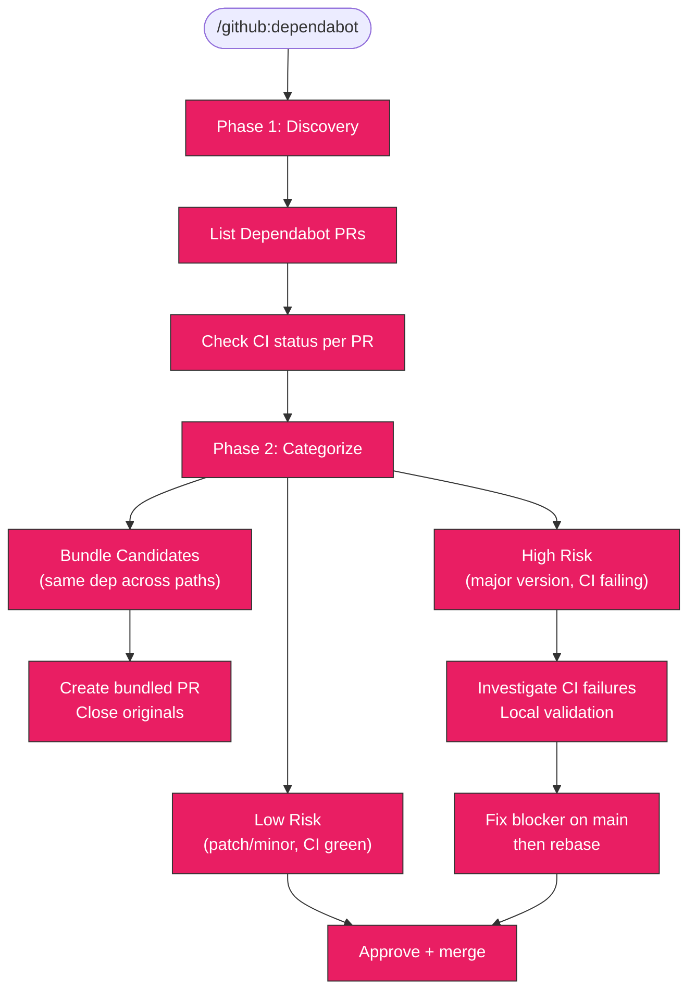

# Dependabot PR Triage

Analyze all open Dependabot PRs, categorize by risk, bundle duplicates into
single PRs, fix CI blockers, and approve safe merges.

## When to Use

- Dependabot PRs are piling up (5+)
- Weekly or biweekly dependency grooming
- Before a release freeze to clear the backlog
- After enabling Dependabot on a new repo

## Variables

Set these at the start of every session:

```bash
export OWNER=kagenti
export REPO=agent-examples
export LOG_DIR=/tmp/dependabot-triage/$REPO
mkdir -p $LOG_DIR
```

## Workflow Diagram



## Phase 1: Discovery

### List all Dependabot PRs with CI status

```bash
gh pr list --repo $OWNER/$REPO --state open --json number,title,author,createdAt,updatedAt,statusCheckRollup,mergeable --jq '.[] | select(.author.login == "app/dependabot" or .author.login == "dependabot[bot]")' > $LOG_DIR/dependabot-prs.json
```

Parse summary:

```bash
cat $LOG_DIR/dependabot-prs.json | jq -r '{number, title: .title[:80], updated: .updatedAt[:10], mergeable, ci: ([.statusCheckRollup // [] | .[] | select(.conclusion != null) | .conclusion] | unique)}'
```

### Check CI failures for specific PRs

```bash
gh pr checks <NUMBER> --repo $OWNER/$REPO
```

### Check main branch CI health

```bash
gh run list --repo $OWNER/$REPO --branch main --limit 3 --json conclusion,displayTitle
```

If main is failing the same checks, the Dependabot failures may be pre-existing.

## Phase 2: Categorization

Sort each PR into exactly one bucket:

### Low Risk / Safe to Merge

- Minor or patch version bumps
- CI passing (all checks green)
- No known breaking changes in changelog
- GitHub Actions version bumps
- Docker base image digest bumps (single Dockerfile)

### Bundling Candidate

Multiple PRs updating the same dependency across different agent/tool
directories. Common in this repo since agents share many transitive deps
(e.g., urllib3, pydantic, opentelemetry bumped across 10+ agents at once).

Identify bundles:

```bash
# Group by package name (strip directory path from title)
cat $LOG_DIR/dependabot-prs.json | jq -r '.title' | sed 's| in /.*||' | sort | uniq -c | sort -rn | head -10
```

### High Risk / Manual Intervention

- **Major version bumps** (e.g., a2a-sdk 0.x → 1.x, pydantic 2 → 3)
- **Core runtime dependencies** (pydantic, httpx, langchain-core, a2a-sdk)
- **Security-critical libraries** (cryptography, python-keycloak)
- **CI failing due to the dependency change itself** (not pre-existing)

For high-risk PRs, check the changelog:

```bash
gh pr view <NUMBER> --repo $OWNER/$REPO --json body --jq '.body'
```

## Phase 3: Execution

### Low Risk: Approve and merge

```bash
gh pr review <NUMBER> --repo $OWNER/$REPO --approve --body "Low-risk Dependabot update. CI passing."
gh pr merge <NUMBER> --repo $OWNER/$REPO --merge
```

### Bundles: Create bundled PR and close originals

1. Create a branch from main:

```bash
git checkout -b build/bundle-<description> main
```

2. For each PR in the bundle, apply the version bump to the relevant
   `pyproject.toml` and regenerate the lock file:

```bash
# For each affected directory:
cd <directory>
uv lock --upgrade-package <package-name>
cd -
```

3. Commit with references to originals:

```bash
git commit -s -m "build(deps): <description>

Bundles Dependabot PRs #N, #N, #N into a single update.

Assisted-By: Claude (Anthropic AI) <noreply@anthropic.com>"
```

4. Push and create PR:

```bash
git push origin build/bundle-<description>
gh pr create --repo $OWNER/$REPO --title "build(deps): <description>" --body "..."
```

5. Close the originals:

```bash
gh pr close <NUMBER> --repo $OWNER/$REPO --comment "Superseded by #<bundled-PR>"
```

### High Risk: Investigate, fix, validate

1. **If CI fails due to pre-existing issues**: fix on main first, then rebase.

2. **If CI fails due to the dependency change**: checkout the PR branch,
   fix locally, push to a new superseding branch.

3. **For major version bumps**: run the startup test locally:

```bash
cd <agent-directory>
expect -f test_startup.exp
```

4. For agents with pytest coverage, also run unit tests:

```bash
python -m pytest tests/<agent-or-tool>/ -v
```

## Presentation Format

Present the analysis as a table before taking action:

```markdown
## Dependabot PR Triage — $OWNER/$REPO

| PR | Change | Component | CI | Risk | Action |
|----|--------|-----------|----|------|--------|
| #N | dep X.Y → X.Z | a2a/agent | PASS | Low | Merge |
| #N | dep A.B → C.D | mcp/tool | FAIL | High | Investigate |
| #N | urllib3 2.6→2.7 | 5 agents | PASS | Low | Bundle |

### Proposed Bundles
- **Bundle 1**: #N, #N, #N — urllib3 across 5 directories
- **Bundle 2**: #N, #N — opentelemetry minor updates

### Execution Order
1. Fix pre-existing CI issues (if any)
2. Merge low-risk PRs
3. Create and merge bundled PRs, close originals
4. Validate and merge high-risk PRs
```

Wait for user approval before executing.

## Task Tracking

On invocation:

1. `TaskList` — check for existing dependabot triage tasks
2. Create one task per execution phase:
   - `dependabot | Phase 0 | Fix CI blockers`
   - `dependabot | Phase 1 | Merge N low-risk PRs`
   - `dependabot | Phase 2 | Bundle N duplicate PRs`
   - `dependabot | Phase 3 | Validate high-risk PRs`
3. `TaskUpdate` as each phase completes

## Troubleshooting

### CI failures across many PRs
**Symptom**: Multiple unrelated PRs fail the same CI check (usually test-startup).
**Cause**: Often a pre-existing issue on main, or `uv.lock` out of sync.
**Fix**: Ensure main is green first. For lock issues, verify dependabot.yml uses
`package-ecosystem: uv` (not `pip`) so `uv.lock` is updated atomically.

### Cannot push to Dependabot branch
**Symptom**: Dependabot branches are read-only.
**Fix**: Create a new branch from main, apply the same changes plus fixes,
create a new PR that supersedes the original, then close the original.

### Bundled PR has merge conflicts
**Symptom**: The bundled PR conflicts after other PRs were merged.
**Fix**: Rebase onto main and re-run `uv lock` in affected directories.

## Related Skills

- `orchestrate:review` — Review orchestration PRs
- `orchestrate:ci` — CI workflow configuration
