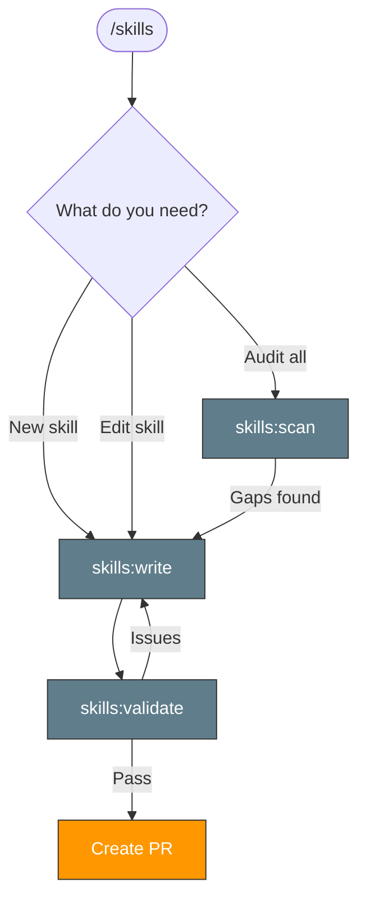

> Follow this diagram as the workflow.

# Skills Management

Skills for managing the skill system itself.

## Worktree-First Gate

Before creating or editing any skill, consider creating a worktree:

```bash
git worktree add .worktrees/skills-<topic> -b docs/skills-<topic> main
```

Then work in the worktree, validate, and create a PR.

## Available Skills

| Skill | Purpose |
|-------|---------|
| `skills:write` | Create new skills or edit existing ones following the standard template |
| `skills:validate` | Validate skill format, naming, and structure |
| `skills:scan` | Audit repository skills — gaps, quality, connections, diagrams |

## Related Skills

- `orchestrate` — Orchestrate other repos using skills
- `orchestrate:replicate` — Bootstrap skills into target repos
